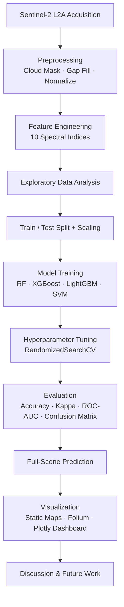

## GeoAI for Land Use / Land Cover Classification using Sentinel-2 Satellite Imagery and Machine Learning


An end-to-end, open-source **GeoAI** workflow that turns raw Sentinel-2 L2A satellite imagery into a validated Land Use / Land Cover (LULC) map, covering data acquisition, cloud masking, spectral index engineering, exploratory analysis, multi-model machine learning, hyperparameter tuning, rigorous evaluation, and publication-quality static + interactive visualization.

---

## Project Overview

Land use and land cover mapping is a foundational input for disaster risk management, urban planning, agricultural monitoring, and climate adaptation, all central to environmental research in a rapidly changing delta nation like Bangladesh. This project builds a fully reproducible pipeline that classifies every pixel of a Sentinel-2 scene into six land-cover classes (Water, Forest, Cropland, Built-up, Bare Soil, Wetland) using classical machine learning enhanced with a 10-index spectral feature stack.

## Objectives

- Build a complete, reproducible remote-sensing-to-ML pipeline using **only free, open-source** data and tools.
- Engineer a rich spectral feature space (10 raw bands + 10 derived indices) proven to separate LULC classes.
- Train and rigorously compare four ML model families (Random Forest, XGBoost, LightGBM, SVM).
- Produce a validated, publication-quality final land-cover map with uncertainty (prediction confidence) quantification.
- Ship a repository that runs identically on Kaggle, on GitHub Actions/CI, or fully offline.

## Features

- **Dual data path**: live Sentinel-2 L2A download via the free Microsoft Planetary Computer STAC API, or a physically-informed offline synthetic generator for network-isolated environments (both feed the identical downstream pipeline).
- **Full preprocessing chain**: SCL-style cloud masking, gap filling, band selection, percentile normalization.
- **10 spectral indices**: NDVI, NDWI, MNDWI, NDBI, SAVI, EVI, BSI, GNDVI, NBR, RENDVI.
- **4-model comparison** with 5-fold cross-validation, `RandomizedSearchCV` hyperparameter tuning, learning/validation curves.
- **Full evaluation suite**: accuracy, Cohen's kappa, per-class precision/recall/F1, confusion matrix, multi-class ROC/AUC, SHAP explainability, error analysis, prediction-confidence diagnostics.
- **Publication-quality outputs**: 300 DPI figures, an interactive Folium web map, and a Plotly dashboard.
- **Modular `src/`**: every pipeline stage is a reusable, importable, PEP8 Python module (not notebook-only code).

## Dataset

| Source | Product | Access | Cost |
|---|---|---|---|
| [Microsoft Planetary Computer](https://planetarycomputer.microsoft.com/) | Sentinel-2 L2A (ESA Copernicus) | Public STAC API | Free, no API key |

The default notebook run uses the offline synthetic-scene generator (`src/preprocessing.py::generate_synthetic_sentinel2_scene`) so the pipeline is 100% reproducible without a live internet connection. Setting `USE_REAL_DATA = True` in the notebook's data-acquisition cell switches to a genuine Sentinel-2 L2A download, no code changes needed elsewhere, since both paths return the identical `Scene` data structure.

## Workflow



## Results

Held-out test set (stratified, 30% of a 9,000-pixel stratified sample):

| Model | CV Accuracy | Test Accuracy | Test Macro-F1 | Train Time (s) |
|:---|---:|---:|---:|---:|
| **XGBoost** | 0.9892 | **0.9900** | **0.9900** | 1.34 |
| LightGBM | 0.9897 | 0.9885 | 0.9885 | 1.27 |
| Random Forest (tuned) | 0.9892 | 0.9878 | 0.9878 | 3.26 |
| SVM (RBF) | 0.9871 | 0.9878 | 0.9878 | 0.28 |

All four models exceed 98.5% test accuracy, reflecting strong class separability once the 10-index spectral feature stack is added to the raw bands. See `outputs/figures/` and `outputs/confusion_matrix/` for full diagnostic plots, and `outputs/model_comparison_table.csv` for the raw numbers.

**Sample outputs:**
- `outputs/maps/final_lulc_map.png`: final classified land-cover map
- `outputs/maps/interactive_lulc_map.html`: interactive Folium web map
- `outputs/confusion_matrix/confusion_matrix.png`: normalized confusion matrix
- `outputs/figures/roc_curves.png`: multi-class ROC/AUC
- `outputs/figures/shap_summary.png`: SHAP feature-impact explanation
- `outputs/figures/model_comparison_dashboard.html`: interactive Plotly dashboard


## Future Improvements

- Multi-temporal (time-series) compositing for phenology-aware classification, particularly to separate cropland from seasonally-flooded wetland.
- Deep learning baselines (U-Net / ResNet encoder) for patch-based semantic segmentation, benchmarked against this classical-ML pipeline.
- Sentinel-1 SAR fusion to maintain coverage through the monsoon cloud season.
- Field-verified ground-truth points and cross-validation against ESA WorldCover / ESRI 10 m LULC for independent accuracy assessment.

## License

Released under the [MIT License](LICENSE).

## Citation

If you use this pipeline in your research, please cite:

```bibtex
@software{ali2026geoai_lulc,
  author  = {Ali, Md Khadem},
  title   = {GeoAI for Land Use/Land Cover Classification using Sentinel-2 Satellite Imagery and Machine Learning},
  year    = {2026},
  url     = {https://github.com/mdkhademali/geoai-lulc-sentinel2}
}
```

## Acknowledgements

- **ESA Copernicus Programme** for open, free Sentinel-2 imagery.
- **Microsoft Planetary Computer** for the public STAC API and hosted analysis-ready data.
- The open-source geospatial and ML Python ecosystem: GeoPandas, Rasterio, scikit-learn, XGBoost, LightGBM, SHAP, Folium, Plotly.
- Department of Geography and Environment, National University, Bangladesh.
